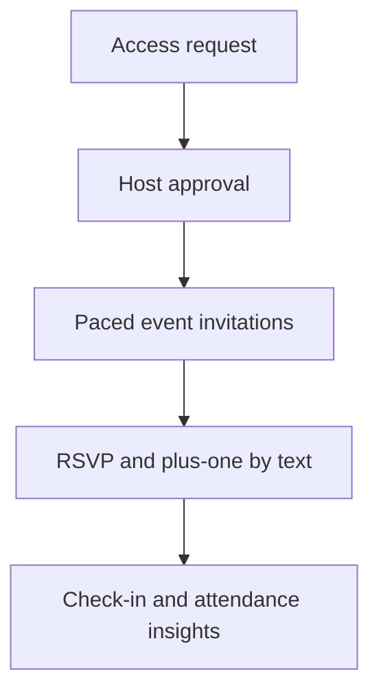

# RSVP Society

RSVP Society is an invite-only event operations platform for a curated, multi-city community. It connects the guest journey—from access request and invitation through check-in and post-event reporting—in one system.

## What makes it different

A basic RSVP form collects a yes or no. RSVP Society coordinates the operating work around that answer:

- **Curated access:** Guests request access; hosts approve and manage the community.
- **Paced invitations:** Hosts invite in waves and can account for replies and available event capacity.
- **Jade, the text concierge:** Guests can ask about an event, respond to invitations, update a plus-one, or opt out by text.
- **Confirmation-aware information:** Guests see arrival details when they are eligible to receive them.
- **A connected door workflow:** Check-in covers confirmed members and their plus-ones; attendance informs future event planning.

## End-to-end guest journey

## The engineering challenge

Guest communication, event capacity, the host dashboard, and door check-in all need to reflect the same event state. A text reply can change a guest's confirmation and available headcount; a later cancellation or plus-one change affects the same plan. RSVP Society is designed to keep those steps connected while giving hosts clear tools to run an event.

## Platform at a glance

- **Web:** Public guest experience and private host dashboard.
- **Application:** JavaScript frontend and Python serverless services.
- **Cloud:** AWS infrastructure managed with Terraform.
- **Messaging:** SMS workflows with an AI-assisted event concierge.
- **Delivery:** GitHub Actions.

RSVP Society is a production-oriented project built around real event operations. Questions about the product flow, architecture, or engineering trade-offs are welcome through GitHub Issues.